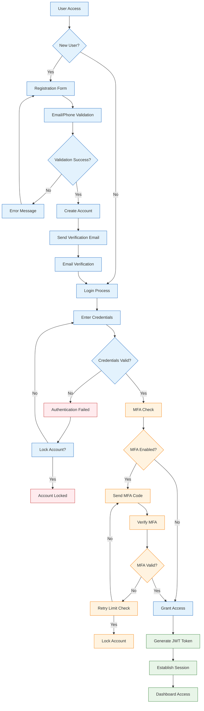
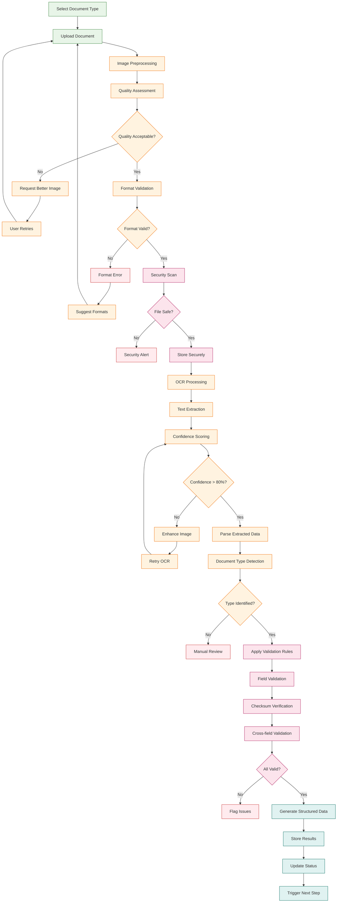
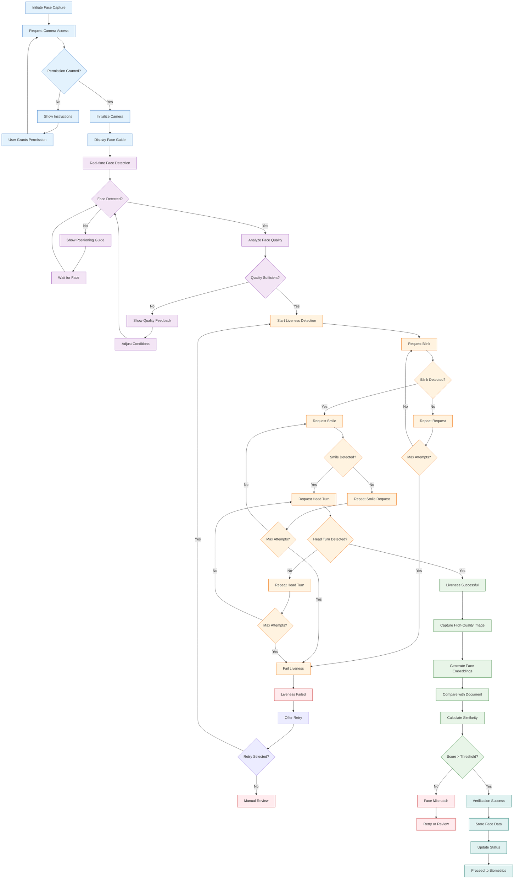
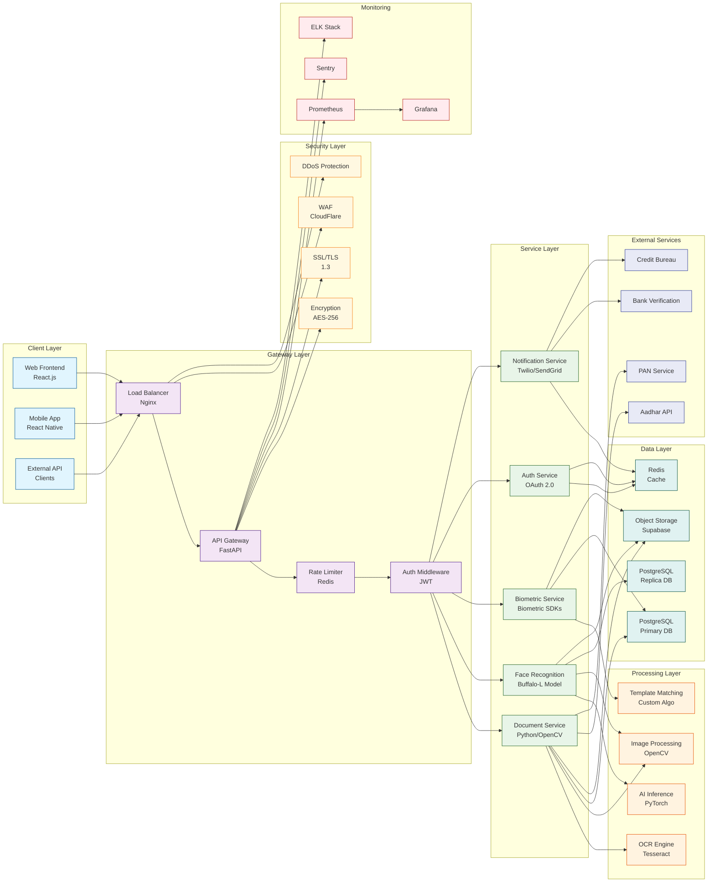
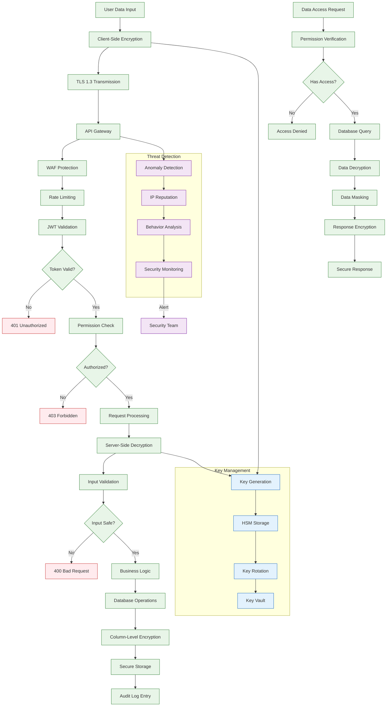
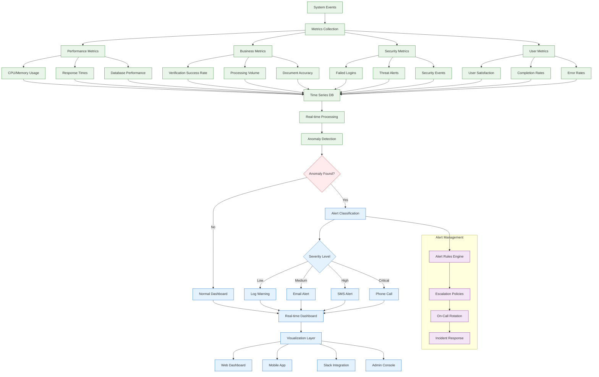
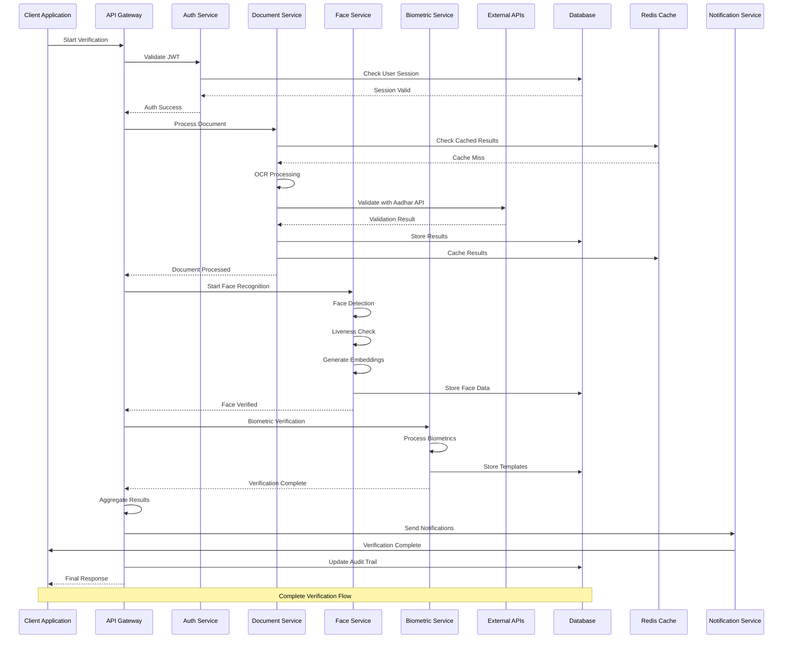
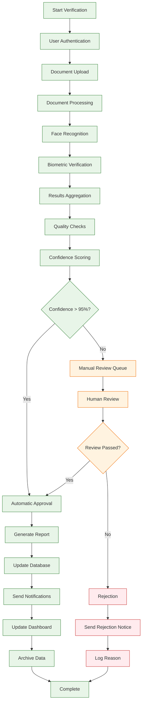

# F-AI AuthX: Comprehensive System Flowchart
## Complete Identity Verification System Architecture

---

## 🌟 Complete System Integration Flowchart

```mermaid
flowchart TB
    %% User Journey Entry Points
    subgraph "User Entry Layer"
        A[User Lands on Homepage]
        B[Mobile App Launch]
        C[API Client Request]
    end

    %% Registration & Authentication
    subgraph "Registration & Authentication"
        D{Already Registered?}
        E[Registration Form]
        F[Email/Phone Validation]
        G[Account Creation]
        H[Email Verification]
        I[Login Process]
        J[Credentials Check]
        K[Multi-Factor Authentication]
        L[JWT Token Generation]
        M[Session Management]
    end

    %% Document Processing Pipeline
    subgraph "Document Processing Pipeline"
        N[Document Type Selection]
        O[Camera/File Upload]
        P[Image Quality Check]
        Q[Format Validation]
        R[Virus Scan]
        S[Secure Storage]
        T[OCR Processing]
        U[Text Extraction]
        V[Data Validation]
        W[Document Verification]
        X[Aadhar/PAN Validation API]
        Y[Cross-Reference Check]
    end

    %% Face Recognition & Biometrics
    subgraph "Face Recognition & Biometrics"
        Z[Face Capture Setup]
        AA[Camera Permission]
        AB[Face Detection]
        AC[Liveness Detection]
        AD[Blink Detection]
        AE[Smile Detection]
        AF[Head Turn Detection]
        AG[Face Embedding Generation]
        AH[Face Matching]
        AI[Similarity Scoring]
        AJ[Biometric Collection]
        AK[Fingerprint Scan]
        AL[Iris Scan]
        AM[Biometric Template]
        AN[Biometric Verification]
    end

    %% System Architecture Core
    subgraph "Core System Architecture"
        AO[API Gateway]
        AP[Load Balancer]
        AQ[Rate Limiter]
        AR[Auth Middleware]
        AS[Request Router]
        AT[Document Service]
        AU[Face Recognition Service]
        AV[Biometric Service]
        AW[Notification Service]
        AX[Verification Orchestrator]
    end

    %% Data Processing Layer
    subgraph "Data Processing & AI"
        AY[OCR Engine]
        AZ[AI Model Inference]
        BA[Image Processing]
        BB[Template Matching]
        BC[Neural Network Processing]
        BD[Feature Extraction]
        BE[Pattern Recognition]
        BF[Anti-Spoofing Algorithms]
        BG[Quality Assessment]
    end

    %% Data Storage Layer
    subgraph "Storage & Database Layer"
        BH[PostgreSQL Primary]
        BI[PostgreSQL Replica]
        BJ[Redis Cache]
        BK[Object Storage]
        BL[Encrypted File Storage]
        BM[Audit Trail Database]
        BN[Session Store]
        BO[Backup Systems]
    end

    %% Security & Encryption
    subgraph "Security & Encryption Layer"
        BP[AES-256 Encryption]
        BQ[TLS 1.3 Protocol]
        BR[Key Management Service]
        BS[Hardware Security Module]
        BT[Access Control]
        BU[Audit Logging]
        BV[Threat Detection]
        BW[Security Monitoring]
        BX[Compliance Engine]
    end

    %% External Integrations
    subgraph "External Services Integration"
        BY[Aadhar Verification API]
        BZ[PAN Validation Service]
        CA[Bank Account Verification]
        CB[Credit Bureau Check]
        CC[SMS Gateway]
        CD[Email Service]
        CE[Government APIs]
        CF[Third-party Verification]
    end

    %% Monitoring & Analytics
    subgraph "Monitoring & Analytics"
        CG[Performance Metrics]
        CH[Real-time Monitoring]
        CI[Health Checks]
        CJ[Alert Management]
        CK[Analytics Dashboard]
        CL[Error Tracking]
        CM[Usage Statistics]
        CN[System Logs]
        CO[Compliance Reporting]
    end

    %% Error Handling & Recovery
    subgraph "Error Handling & Recovery"
        CP[Error Detection]
        CQ[Error Classification]
        CR[Retry Logic]
        CS[Exponential Backoff]
        CT[Circuit Breaker]
        CU[Fallback Mechanisms]
        CV[Deadlock Resolution]
        CW[System Recovery]
        CX[Failover Procedures]
    end

    %% Output & Results
    subgraph "Results & Output"
        CY[Verification Results]
        CZ[Success Notification]
        DA[Dashboard Update]
        DB[API Response]
        DC[Email Confirmation]
        DD[Mobile Push Notification]
        DE[Audit Trail Entry]
        DF[Compliance Report]
    end

    %% Main Flow Connections
    A --> D
    B --> D
    C --> D

    D -->|No| E
    D -->|Yes| I
    E --> F
    F --> G
    G --> H
    H --> I

    I --> J
    J --> K
    K --> L
    L --> M
    M --> AO

    %% Document Processing Flow
    AO --> N
    N --> O
    O --> P
    P -->|Quality OK| Q
    P -->|Quality Poor| O
    Q -->|Valid| R
    Q -->|Invalid| O
    R -->|Safe| S
    R -->|Threat| BW
    S --> T
    T --> AY
    AY --> U
    U --> BA
    BA --> V
    V -->|Valid| W
    V -->|Invalid| CP
    W --> X
    X --> Y
    Y --> AT

    %% Face Recognition Flow
    AT --> Z
    Z --> AA
    AA -->|Granted| AB
    AA -->|Denied| AC
    AB --> AC
    AC --> AD
    AD --> AE
    AE --> AF
    AF --> AG
    AG --> AZ
    AZ --> BC
    BC --> BD
    BD --> AH
    AH --> AI
    AI -->|Score > Threshold| AJ
    AI -->|Score Low| CP

    %% Biometric Flow
    AJ --> AJ
    AJ -->|Optional| AK
    AJ -->|Optional| AL
    AK --> AM
    AL --> AM
    AM --> AN
    AN --> AU

    %% System Architecture Integration
    AO --> AP
    AP --> AQ
    AQ --> AR
    AR --> AS
    AS --> AT
    AS --> AU
    AS --> AV
    AS --> AW
    AS --> AX

    %% Data Processing Connections
    AT --> AY
    AU --> AZ
    AV --> BB
    AZ --> BC
    BA --> BD
    BB --> BE
    BC --> BF
    BF --> BG

    %% Storage Connections
    AT --> BH
    AU --> BI
    AV --> BJ
    AT --> BK
    AU --> BL
    AV --> BM
    AR --> BN
    BH --> BO

    %% Security Layer
    S --> BP
    BP --> BQ
    BQ --> BR
    BR --> BS
    BT --> BU
    BU --> BV
    BV --> BW
    BW --> BX

    %% External Services
    W --> BY
    W --> BZ
    AX --> CA
    AX --> CB
    AW --> CC
    AW --> CD
    AT --> CE
    AX --> CF

    %% Monitoring Integration
    AS --> CG
    AT --> CH
    AU --> CI
    AV --> CJ
    AW --> CK
    AX --> CL
    AX --> CM
    BU --> CN
    CN --> CO

    %% Error Handling
    CP --> CQ
    CQ --> CR
    CR --> CS
    CS --> CT
    CT --> CU
    CU --> CV
    CV --> CW
    CW --> CX
    CX --> AO

    %% Results Flow
    AX --> CY
    CY -->|Success| CZ
    CY -->|Success| DA
    CY -->|API| DB
    CY -->|Email| DC
    CY -->|Mobile| DD
    BU --> DE
    BX --> DF

    %% Styling
    classDef userEntry fill:#e1f5fe,stroke:#01579b,stroke-width:2px
    classDef authFlow fill:#f3e5f5,stroke:#4a148c,stroke-width:2px
    classDef documentFlow fill:#e8f5e8,stroke:#1b5e20,stroke-width:2px
    classDef faceFlow fill:#fff3e0,stroke:#e65100,stroke-width:2px
    classDef systemCore fill:#fce4ec,stroke:#880e4f,stroke-width:2px
    classDef dataProcess fill:#f1f8e9,stroke:#33691e,stroke-width:2px
    classDef storage fill:#e0f2f1,stroke:#004d40,stroke-width:2px
    classDef security fill:#fff8e1,stroke:#f57f17,stroke-width:2px
    classDef external fill:#e8eaf6,stroke:#283593,stroke-width:2px
    classDef monitoring fill:#ffebee,stroke:#b71c1c,stroke-width:2px
    classDef errorHandling fill:#f9fbe7,stroke:#827717,stroke-width:2px
    classDef results fill:#e0f7fa,stroke:#006064,stroke-width:2px

    class A,B,C userEntry
    class D,E,F,G,H,I,J,K,L,M authFlow
    class N,O,P,Q,R,S,T,U,V,W,X,Y documentFlow
    class Z,AA,AB,AC,AD,AE,AF,AG,AH,AI,AJ,AK,AL,AM,AN faceFlow
    class AO,AQ,AR,AS,AT,AU,AV,AW,AX,AP systemCore
    class AY,AZ,BA,BB,BC,BD,BE,BF,BG dataProcess
    class BH,BI,BJ,BK,BL,BM,BN,BO storage
    class BP,BQ,BR,BS,BT,BU,BV,BW,BX security
    class BY,BZ,CA,CB,CC,CD,CE,CF external
    class CG,CH,CI,CJ,CK,CL,CM,CN,CO monitoring
    class CP,CQ,CR,CS,CT,CU,CV,CW,CX errorHandling
    class CY,CZ,DA,DB,DC,DD,DE,DF results
```

---

## 🔄 Detailed Process Flow Breakdown

### 1. User Registration & Authentication Flow

### 2. Document Processing & OCR Pipeline

### 3. Face Recognition & Liveness Detection

### 4. System Architecture & Data Flow

### 5. Security & Data Protection Flow

---

## 📊 System Performance & Monitoring Dashboard

---

## 🔧 Integration Patterns & External APIs

---

## 🎯 Complete Verification Success Flow

---